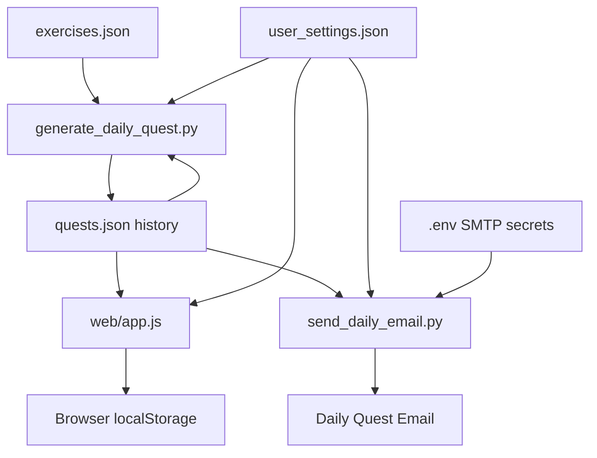

# Architecture

Awakening System is deliberately small and readable. It uses plain files, Python scripts, and vanilla frontend code so the project can be explained without framework magic.

## Data Flow



## Main Components

### `data/exercises.json`

The exercise catalogue is public seed data. Each exercise has:

- `training_types`: attributes/focus areas such as `legs`, `core`, `cardio`, `strength`.
- `workout_styles`: selection filters such as `hiit`, `mobility`, `conditioning`.
- `equipment`: required equipment, used to exclude exercises the user cannot do.
- `sets` and `reps`: used by the UI and timer. Values containing `sec` or `min` become timed steps.

### `scripts/generate_daily_quest.py`

This script creates the next Daily Quest. It:

- reads user settings;
- checks whether the selected day is a scheduled training day;
- filters exercises by equipment and style;
- chooses one common focus for the entire quest;
- avoids repeating the previous quest focus;
- writes the quest into `data/quests.json`;
- sets `expires_at = issued_at + 24 hours`.

### `scripts/send_daily_email.py`

This script sends the current quest by email. It:

- loads SMTP secrets from `.env`;
- loads the recipient from `data/user_settings.json`;
- builds a plain-text fallback;
- builds a dark HTML email using presentation tables for email-client compatibility;
- sends through SMTP.

### `scripts/dev_server.py`

The local development server serves the static app and exposes `/api/settings`. That small API exists because a static HTML page cannot write directly to `data/user_settings.json`.

### `web/app.js`

The frontend owns UI state and user interaction:

- sandbox login state;
- settings modal;
- countdown display;
- quest rendering;
- circuit timer;
- Web Audio cues;
- local progress;
- attribute/rank radar chart.

## Time Remaining

The quest stores an absolute `expires_at` timestamp. The browser calculates:

```txt
time_remaining = expires_at - current_browser_time
```

For a deployed private version, keep `expires_at` in the database and treat it as the source of truth. The frontend should only display the countdown.

## Why No Framework Yet?

This project is meant to show scripting, automation, data handling, and core browser APIs. Avoiding a framework makes the logic easier to inspect and explain in an interview.
